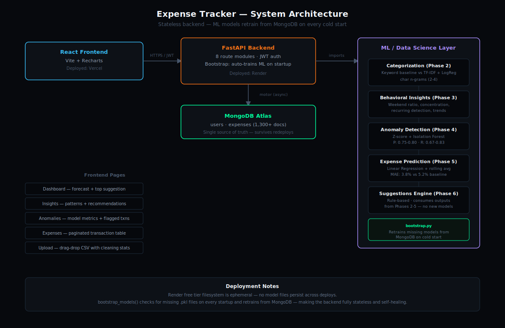

# AI Expense Tracker

A production-grade expense tracking system with real ML — not a CRUD app with charts. Categorization, anomaly detection, forecasting, and rule-based suggestions, all evaluated with precision/recall/MAE on labeled test data.

**Live demo:** https://expanse-tracker-pi-eosin.vercel.app
**API docs:** https://expanse-tracker-api-8h0w.onrender.com/docs

> Note: the backend is on Render's free tier and may take 30-60s to wake up after inactivity. Models retrain automatically from MongoDB on cold start.

---

## What it does

- **Categorization** — TF-IDF + Logistic Regression classifies transactions by merchant name, benchmarked against a keyword-matching baseline
- **Behavioral Insights** — detects spending patterns: weekend vs weekday ratio, category concentration, recurring charges, merchant frequency spikes
- **Anomaly Detection** — Z-score + Isolation Forest running in parallel, evaluated against labeled anomalies (80% precision, 83% recall)
- **Expense Forecasting** — Linear Regression with rolling averages and seasonality features (3.8% MAE vs 5.2% naive baseline)
- **Smart Suggestions** — rule-based engine synthesizing outputs from all four ML modules above into prioritized, actionable recommendations

## Architecture



The backend is stateless by design — Render's free tier filesystem is ephemeral, so all ML models retrain automatically from MongoDB on every cold start rather than relying on saved files surviving a redeploy.

## Tech Stack

| Layer | Technology |
|---|---|
| Frontend | React, Vite, Recharts |
| Backend | FastAPI, Python |
| Database | MongoDB Atlas |
| ML | scikit-learn, pandas, numpy |
| Auth | JWT, bcrypt |
| Deployment | Vercel (frontend), Render (backend) |

## Model Performance

| Model | Metric | Score |
|---|---|---|
| Categorization | Accuracy (ML vs keyword baseline) | TF-IDF+LogReg vs keyword baseline, tested on held-out transactions |
| Anomaly Detection (Z-score) | Precision / Recall / F1 | 0.75 / 0.83 / 0.79 |
| Anomaly Detection (Isolation Forest) | Precision / Recall / F1 | 0.80 / 0.67 / 0.73 |
| Expense Forecasting | MAE | 3.8% (vs 5.2% rolling average baseline) |

All metrics above were measured on synthetic data with controlled patterns and labeled anomalies. Real bank statement data is expected to shift these numbers — see "Limitations" below.

## Running Locally

### Backend
```bash
cd backend
python -m venv venv
venv\Scripts\activate          # Windows
pip install -r requirements.txt
# create .env with MONGODB_URL, SECRET_KEY, ALGORITHM, ACCESS_TOKEN_EXPIRE_MINUTES
uvicorn app.main:app --reload
```

### Frontend
```bash
cd frontend
npm install
# create .env with VITE_API_URL=http://localhost:8000
npm run dev
```

## Limitations & Honest Notes

- Model metrics above are measured on synthetic, generator-produced data with controlled patterns. Keyword categorization accuracy is inflated because generated merchant names match the keyword list exactly — real bank statements ("SWIGGY\*ORDER293821") will lower keyword accuracy while the ML model degrades more gracefully due to character n-gram matching.
- Real bank data integration (CSV upload) is supported and tested with 5 statement formats, but full production deployment would use India's Account Aggregator framework rather than manual CSV export.
- Free-tier hosting means the backend sleeps after 15 minutes of inactivity; the first request after idle time triggers model retraining and may take up to a minute.
- ML models (categorizer, Isolation Forest, predictor) are trained globally across all data rather than per-user, since any single new account has too little data to train its own model. Per-user evaluation metrics and predictions are still computed only from that user's own transactions — a brand-new account with zero transactions correctly shows empty states across the dashboard, anomaly, and forecast pages rather than another account's cached results. This was caught and fixed during manual multi-account testing before deployment, not assumed correct by default.

## Project Structure

```
expense-tracker/
├── backend/
│   ├── app/            # FastAPI routes, auth, database
│   └── ml/              # categorization, insights, anomaly, prediction, suggestions
└── frontend/
    └── src/
        ├── pages/        # Dashboard, Insights, Anomalies, Expenses, Upload
        └── services/     # API client
```

## Author

Built by Apoorv Jha as an 8-phase project — see commit history for phase-by-phase development.
